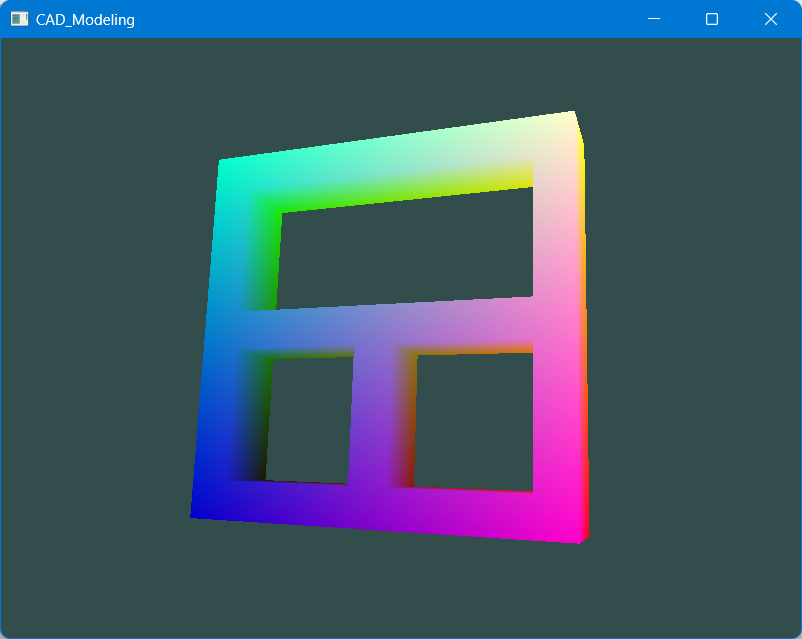
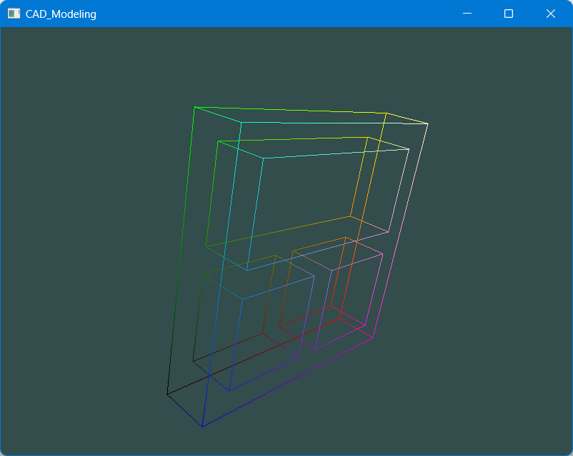

# CAD_modeling
浙江大学《三维CAD建模》大作业
## 环境
windows，VS2019

OpenGL 3.3 + glfw + glad

poly2tri：将带内环的面三角化

这些第三方库的h文件和lib文件都已经放在third_libraries的Include和Libs文件中，不需要再进行下载
## 使用说明

使用Visual Studio2019直接打开CAD_modeling.sln文件

把third_libraries文件夹中的Include和Libs的路径分别添加到外部包含目录和库目录中，在附加依赖项中添加：glfw3.lib、opengl32.lib、Project1.lib（poly2tri的静态库文件）

## 操作说明

模型是带有两个通孔的长方体。按1和0可在着色模型和线框模型之间进行切换

## 结果展示

